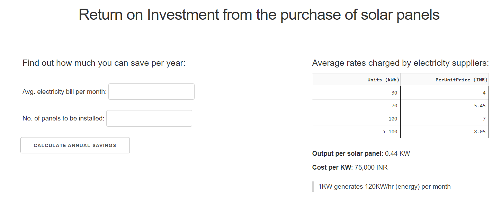

<!-- CONTACT Section Starts -->
### CONTACT

<!-- Add your details -->
✉️: jaslinpurification@gmail.com 
&nbsp;&nbsp; Singapore 
&nbsp;&nbsp;&nbsp;&nbsp;&nbsp; [LinkedIn](https://www.linkedin.com/in/jaslin-purification/) 

<!-- CONTACT Section Ends -->

<!-- ABOUT Section Starts -->
### ABOUT
<!-- Add link to your picture -->

<!-- Add your details -->

I am __Jaslin__, a budding data analyst and marketing professional with 4 years of direct experience and proven expertise in digital marketing, copywriting, and advertising in both the B2B and B2C landscapes. My skills in the marketing arena help me to understand the kind of data that is key to a company’s bottom line. Combined with my technical skills, I can present an in-depth and meaningful overall picture and provide valuable data-driven insight.  

<!-- Add link to the sections -->
[Education](#education)  
[Certifications](#certifications)  
[Projects](#projects)  
[Experience](#experience)  

<!-- ABOUT Section Ends -->

<!-- EXPERIENCE Section Starts -->
### EDUCATION
<!-- Add your details -->
##### BOSTON CONSULTING GROUP
Business & Data Analytics – Rapid & Immersive Skill Enhancement (RISE) Programme 
April 2021 to Oct 2021

A 6-month programme designed to build competency in high-demand business and digital skills. It leverages on BCG’s industry experts who are at the top of their fields and covers technical, business, and soft skills. Includes real work experience.

Curriculum: 
• Python programming   
• SQL 
• Relational databases 
• Business intelligence (linking business & analytics) 
• Dashboard design 
• Statistical analysis & regressions 
• Machine learning algorithms 
• Structured problem solving 
• Building a business case 
• Story-lining, presentation & communication 
• Human-centered design 
• Business excel modelling 
• Design thinking 
• Agile methodology 

Special Achievements: 
3 consecutive “Top 2 teams” awards for the following projects:

•RISE Hackathon: Made an existing app more appealing to users by listening to their pain-points, and improved the UI/UX and product features based on their feedback. As one of the top teams, I got the opportunity to present to C-suite executives from Olam Digital. 

•Business Essentials project: solved business problems for a Fortune 500 company. Core modules included structuring & problem solving, excel modelling & analysis, storylining, slide writing & business presentations

•Digital Essentials projects: re-imagined and re-designed common experiences in Singapore from the perspective of the customer journey and end user.
 	 	 	 	         
##### OKLAHOMA CITY UNIVERSITY
Bachelor’s Degree in Liberal Arts (conc. in Mass Communication) - Class of 2017

Coursework includes public relations, advertising campaign planning & management, news writing, behavioural science, politics, research methodology, and more.  

##### JURONG JUNIOR COLLEGE
A Levels - Class of 2013
H2 subjects: Physics, Chemistry, Mathematics, Mother Tongue (Bengali)  
H1 subjects: General Paper, English Literature, Project Work 

<!-- EDUCATION Section Ends -->

<!-- CERTIFICATIONS Section Starts -->
### CERTIFICATIONS
<!-- Add your details -->
•	Introduction to Python Programming – Udacity  
• Programming Foundations: Object-Oriented Design (Certificate Id: AeNsCe9tZIDfcHjWyilPAflo2_9z  
•	Pandas Essential Training – LinkedIn Learning (Certificate Id: AZQh8zobTt-I79Jj7OLafZ13DTZr)  
•	SQL Essential Training – LinkedIn Learning (Certificate Id: AWKlQ0QQT5cN83mQm_ZpxzypZFW1)  
• Introduction to Business Analytics (Certificate Id: AcnMXiXkjQyXeYaK_oyjyH7rl21t)  

<!-- EDUCATION Section Ends -->

<!-- PROJECTS Section Starts -->
### PROJECTS
<!-- Add your details -->

<!-- Add your details -->

#### PYDASH DASHBOARD FOR SOLAR PANEL INVESTMENT

   
User's monthly input bill is converted to power in the backend based on the charges of a big electricity supplier in Bangalore. 
The reduced bill resulting from the user's chosen number of solar panels is then calculated, and an IRR graph showing the optimum no. of solar panels is shown to the user in the front-end. 

Layout was designed using an external stylesheet and modified to suit the content. 

[Click here to view codebase](https://github.com/JaslinPure/Jaslin_Purification/blob/1d90276d002a3c6bce38e363da53d40c45f0b96e/app.py)

### EXPERIENCE  
<!-- Add your details -->

##### Joseph Tan Jude Benny LLP, Singapore 
Marketing Executive - May 2019 to December 2021 

Sole marketer handling all marketing events, web content creation & management, social media campaigns, branding & design of marketing collateral etc. Came up with and implemented the marketing strategies for 2019 and 2020, sticking to and managing the annual budget.  

•	Organised the company's first international legal conference, managing everything from hotel partnerships (scouting and choosing suitable locations, booking event space and securing the best rooms for guests) to vendors. Communicated effectively with all stakeholders & handled all guest relations and payment processing.  
•	Increased LinkedIn followers by over 200% since joining by focusing on content creation that targets the ideal market.   

##### Salt Creatives Pte Ltd, Singapore  
Copywriter - April 2018 to October 2018   

Wrote copy, provided content direction and social media management services for key clients.  
•	In charge of monthly EDMs for Hewlett Packard APJ (HP Inc.) and Infor Global Solutions Inc.  
•	Social media planning, copywriting, and management of 6 FMCG accounts under Melbourne Drugs  
•	Worked on one-off projects with government organisations such as SAFRA, and educational organisations   

##### Dentsu Aegis Network, Singapore  
Production Intern - July 2017 to November 2017  
Assisted the Senior Producer to handle various key client accounts including Hitachi, Sompo Insurance, Subway and Shiseido. Handled the full production process from understanding the client’s creative brief, sourcing for talent, scouting locations, scheduling and coordinating shoots, to delivery of the final output to clients.  

Special Achievements:  
•	Subway Singapore: helped to cast 42 talents for the Subway Bogo 2017 video and coordinated the 8 hour shoot single-handedly. The final video garnered 107k views on YouTube within the first week of publishing. Won "Best use of Mobile" at the Singapore Media Awards 2018. 
